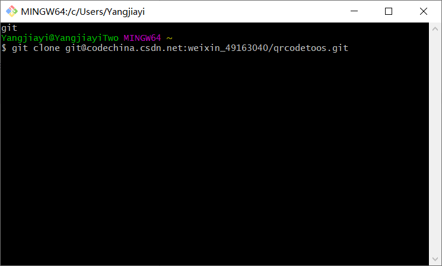
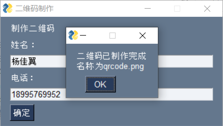
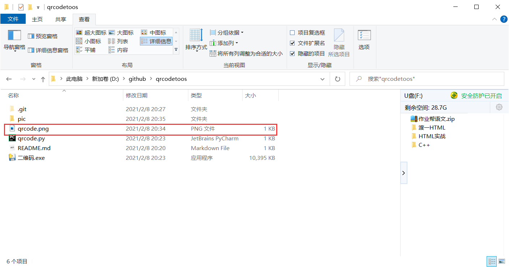

# qrcodeToos


备注：自动生成二维码，本版本的版本号为1.0，只能包含姓名和电话，后续会继续更新（不喜勿喷）


## 一."二维码.exe"的使用方法  
### 1)获取文件
使用本产品前先通过下面命令获取
```git
git clone git@codechina.csdn.net:weixin_49163040/qrcodetoos.git
```

如下图：  



<br>

## 2)使用方法

获取文件之后，双击打开“二维码.exe”,就会出现以下界面：


输入信息后会出现一个弹窗，按确定，再关闭软件：  



最后软件旁边就会多出一张图片：



## 二."qrcode.py"的使用方法

再打开文件之前，我们先要打开命令提示符输入  

```python
pip3 install PySimpleGUI
```

然后用python编辑器打开，打开之后的使用方法和“二维码.exe”的一样